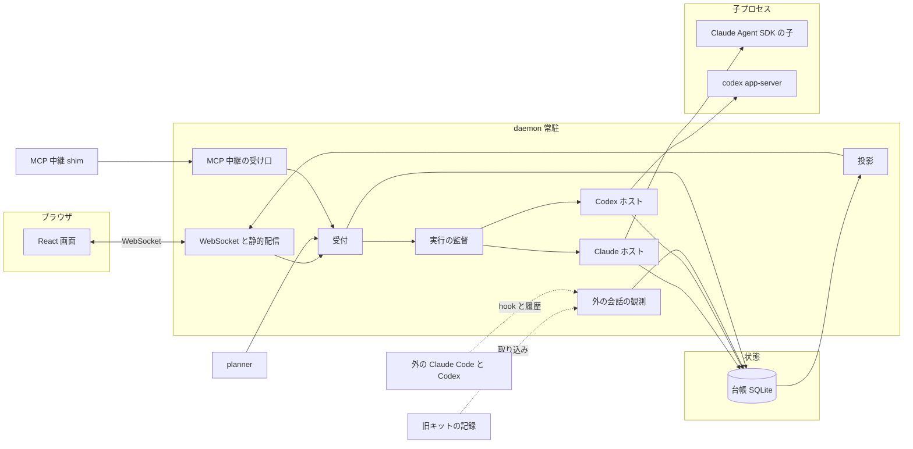

# agent-graph 設計書 v2

- 版: 2026-10-07 初版
- 読み手: これから実装する AI エージェントと人
- 位置づけ: 作り直しの正本。実装者はこの文書だけで着手できる
- 参照元: `docs/agents/reviews/2026-10-07-architecture-review.md` の F1 から F9
- 参照元: `docs/agents/research/2026-10-07-agent-hosting.md` と二つの試作の報告
- 残す部分の参照元: `docs/agents/architecture.md`

## 目的

agent-graph を、ブラウザで完結するマルチエージェントのコンソールとして作り直す。
Claude Code と Codex を混ぜて動かし、誰が何をしているかと成果の差分を 1 つの画面で追える。
Cursor や Orca と同等以上の管理体験を持ち、世界に公開できる水準を目指す。

今の作りは、観測した事実の推測から会話と実行の状態を導いている。
レビューはこれを F1 から F9 の構造的欠陥と判定した。
本書は表示の修正ではなく、状態を導く土台を作り直す。

### 解く問題

| 識別子 | 欠陥 | 本書の解決先 |
| --- | --- | --- |
| F1 | 会話の同一性が表示層だけにある | 関係の実体と訂正の追記 |
| F2 | 無更新と切断から終了を断定する | 不明の状態と終了の根拠表 |
| F3 | 旧キットの counter への誤書き込みと無人実行の誤採番 | 名前の所有と別名 |
| F4 | 履歴形式の非互換と入力の欠落を隠す | 観測の対応範囲と冪等な取り込み |
| F5 | agc と MCP の分断で親子が欠ける | 受付の一本化 |
| F6 | shim が再接続せず受理状態が不明 | 再接続と冪等な委譲 ID |
| F7 | コマンドと時刻から作成者を断定する | 成果物の確定と帰属の 3 段階 |
| F8 | 推定と欠落を事実として見せる | 画面の状態語彙 |
| F9 | 本文を秘匿せずに保存する | 保存前の秘匿と保持の制御 |

### 製品の価値

差別化の核は、製品をまたぐ委譲の因果と、変更と検証の結果を 1 つの証拠として追えることである。
Claude が実装し Codex がレビューする流れが、1 つの木と 1 つの差分に収まる。
欠落は隠さず不明と示す。この正直さを製品の信頼の根拠にする。

### 範囲外

- クラウドで動く会話の管理
- 複数ユーザーの同時利用
- 計算機をまたぐ常駐の同期

## 決定事項

次の 12 件は決定済みである。実装者は覆さない。
各件の詳細は後続の節に書く。ここでは内容と理由だけを示す。

### 1. 常駐による起動と保持

- 内容: 常駐がエージェントを自分で起動して持つ。Claude は Agent SDK を使う。Codex は app-server を stdio で使う。
- 理由: 自分で起動した会話は、同一性と生死と承認と中断を公式の型で得られる。推測が要らない。
- 試作の結果: どちらの試作も、隔離環境の通信と認証の制約で正常な応答に届かなかった。
- 試作の結論: 土台の採用は否定されておらず、実証は未完了である。

試作で動かなかった機能の扱いを次の表で決める。
代わりの手段は、実機の確認が取れるまで既定とする。確認できた機能から本来の手段へ切り替える。

| 機能 | 試作の状態 | 決める手段 |
| --- | --- | --- |
| Claude の認証と通信 | 隔離環境で未ログイン扱いになった | 常駐は launchd で隔離の外に置く。起動時に `accountInfo` で認証の種別を確かめる。 |
| Claude の文字差分 | 未検証 | `includePartialMessages` を試す。動かなければ完了した発言を単位に送る。 |
| Claude の承認 | `canUseTool` が未検証 | 第一は `canUseTool`。動かなければ `PermissionRequest` の hook 関数を使う。どちらも使えなければ `permissionPrompts: 'none'` で拒否し、拒否を承認の受け箱に残す。 |
| Claude の中断 | `interrupt` が未検証 | 第一は `interrupt`。動かなければ `abortController` で止めて `resume` で続ける。 |
| Claude のモデル変更 | `setModel` が未検証 | 第一は `setModel`。動かなければターンの境界で `close` し、新しいモデルで `resume` する。 |
| Claude の再開 | `resume` が未検証 | 再開に失敗した会話は閲覧のみにする。新しい会話として続ける操作を出す。 |
| Codex の応答 | 経路探索の失敗で未到達 | 認証と通信は Claude と同じ扱いにする。接続失敗は `systemError` として不明にせず失敗で示す。 |
| Codex の承認 | 試作は未到達。調査の実機では確認済み | サーバからの要求へ同じ要求 ID で答える。試作側の実装を使う。 |
| Codex の子スレッド | 型だけで未確認 | 因果は受付の依頼 ID で持つ。`parentThreadId` は補助の根拠に回す。 |
| Codex の実行中の effort 変更 | 調査で拒否された | 次の `turn/start` で上書きする。実行中の変更は提供しない。 |
| Codex の分岐のモデル | 省略すると元を継がなかった | `thread/fork` では必ずモデルを指定する。 |
| Codex の hook | 差し込めない | 承認の要求と item の通知で判断する。 |

### 2. 外の会話の従の経路

- 内容: ターミナルや ChatGPT アプリで始めた会話は、観測で取り込む従の経路にする。
- 内容: 確かでない状態は不明と表示する。経過時間だけで終了を断定しない。
- 内容: 外の会話をコンソールへ引き継ぐ操作を用意する。
- 理由: どちらの手段も、外で動く会話を制御下に置けない。観測を従に限れば、制御できないものを制御できると見せずに済む。

### 3. 事実の台帳

- 内容: 事実の台帳を正とする。取り込みは出所と識別子を持つ事実の追記に限る。
- 内容: 画面の状態は台帳から組み立てる。同じ入力の再送と順序の逆転でも増殖しない。訂正は追記で行う。
- 理由: 推測を正規データへ書き換えると誤統合を取り消せない。追記だけなら再処理と調査ができる。

### 4. 実体の分離

- 内容: 作業、会話、関係、実行、接続、発言、委譲、成果物を別々の実体にする。
- 理由: 今の `sessions` 行は会話と実行と接続を混ぜている。レビューの表を出発点にし、混在が F1 と F2 の根になる。

### 5. 受付の一本化

- 内容: 委譲の入口は 1 つの受付に集める。画面、MCP の道具、planner、旧キットの記録の取り込みが同じ受付を通る。
- 内容: 委譲には再送しても変わらない ID を付ける。
- 理由: 入口ごとに台帳が分かれると親子が欠ける。再送で別の委譲が生まれると二重に起動する。

### 6. 中継の再接続

- 内容: MCP の中継は再接続する。受理済みの委譲を二重に起動しない。
- 理由: 常駐の更新で既存の会話が委譲の道具を失うと、可用性の契約が成り立たない。

### 7. 名前の所有

- 内容: セッションの名前は agent-graph が持つ。旧キットの番号は別名として取り込むだけにする。
- 内容: 旧キットの counter には書き込まない。
- 理由: 外部の counter への書き込みは副作用であり、採番の取り違えを生んだ。

### 8. 作業ツリーと成果の確定

- 内容: 管理する実行は、開始時の作業ツリーと基準のコミットを記録する。終了時に成果のコミットを確定する。
- 内容: Git の帰属は、確定と推定と不明を分けて出す。
- 理由: コマンドの文字列と時刻から作成者を断定すると誤帰属になる。不明を人の変更に読み替えてはならない。

### 9. 固定した差分のレビュー

- 内容: レビューは差分の版を固定する。行への指摘をエージェントに返して直させ、再検証する。
- 内容: 差分が変われば古い承認を無効にする。
- 理由: 版を固定しなければ、承認が何に対するものか分からない。ここが Cursor に対する差別化の中心である。

### 10. 保存前の秘匿

- 内容: 保存の前に秘密を伏せる。保存の範囲と保持期間を Settings で決められるようにする。
- 理由: 本文を保存する経路に境界処理がなく、鍵が別の保存庫へ複製されうる。

### 11. 依存の方針

- 内容: core は Node 標準と `node:sqlite` だけを保つ。daemon は Agent SDK と WebSocket の実装を依存に入れてよい。
- 内容: 画面は TypeScript と React で作り、Vite で静的なファイルに組んで daemon が配る。Bun の単一バイナリの方針は外す。
- 理由: 常駐の起動に公式の SDK が要る。公開水準の画面には部品の資産が要る。単一バイナリはどちらとも両立しない。

### 12. WebSocket と続きからの送信

- 内容: ブラウザと daemon は WebSocket で結ぶ。再接続したときは台帳の続きから送る。
- 理由: 常駐が起こす出来事を即座に双方向で届ける必要がある。再接続で欠落と二重の表示を出してはならない。

## 構成

### 全体



常駐は 1 台の計算機で 1 つ動く。台帳への書き込みは常駐だけが行う。
子プロセスと外の会話と画面は、常駐を通してだけ台帳に触れる。

### パッケージ

| パッケージ | 責務 | 依存してよい先 |
| --- | --- | --- |
| `core` | 事実の型、台帳、投影、秘匿、状態の規則、受付の規則、割り当て、受け入れ検証 | Node 標準と `node:sqlite` だけ |
| `daemon` | ホスト、観測、受付の口、MCP の受け口、WebSocket、静的配信、実行の監督 | `core`、Agent SDK、WebSocket の実装 |
| `dashboard` | React の画面。Vite で組む | `daemon` の WebSocket と HTTP だけ |
| `adapters` | hook、MCP 中継 shim、Claude Code と Codex の設定の生成 | `core` の型だけ |
| `planner` | tasks.yaml の実行。受付の利用者の 1 つ | `daemon` の受付の口 |

境界の規則は次の 4 つである。

- `core` は副作用を持たない。ファイルとプロセスと通信は `daemon` が担う
- `core` に置く投影は純粋な関数にし、台帳の事実の集合だけから結果を決める
- 画面は台帳を直接読まず、`daemon` が配る投影だけを読む
- `planner` と `adapters` は受付を迂回しない

### 依存

| パッケージ | 追加する依存 | 理由 |
| --- | --- | --- |
| `daemon` | `@anthropic-ai/claude-agent-sdk` | Claude の常駐起動 |
| `daemon` | `ws` | WebSocket の実装 |
| `dashboard` | `react`、`react-dom`、`vite`、`@vitejs/plugin-react` | 画面の構築 |
| `dashboard` | `@xyflow/react` | 委譲グラフの描画 |

ライセンスが MIT 以外の依存を追加するときは、段の受け入れでライセンスを確認する。
SDK の版は 0.3.291 を既定の起点とし、版を固定して `pnpm-lock.yaml` に含める。

### 画面の配信

- `dashboard` は `vite build` で `packages/dashboard/dist` に静的ファイルを出す
- `daemon` は `127.0.0.1` だけに bind して `dist` を配る
- 画面の開発時は Vite の開発サーバが `daemon` の WebSocket へ中継する
- 今の `packages/dashboard/public` は `legacy` へ移し、新画面が追いつくまで `/legacy` で配る

### 通信

ブラウザと daemon は 1 本の WebSocket で結ぶ。HTTP は静的ファイルと snapshot の取得だけに使う。

| 方向 | 種類 | 内容 |
| --- | --- | --- |
| 画面から常駐 | `hello` | 最後に受け取った `seq` と購読する範囲 |
| 画面から常駐 | `cmd` | 操作と `cmd_id`。同じ `cmd_id` の再送は 1 回だけ作用する |
| 常駐から画面 | `patch` | 投影の差分と、それを生んだ台帳の `seq` |
| 常駐から画面 | `delta` | 文字単位の出力。台帳には載せない |
| 常駐から画面 | `resync` | 続きから送れないときの指示 |
| 常駐から画面 | `ack` | `cmd` の結果 |

再接続の規則は次のとおりである。

1. 画面は `hello` に最後の `seq` を載せる
2. 常駐は `seq` より後の事実から影響を受けた投影の差分を送る
3. 差分の保持が尽きたか、投影の再構築があったときは `resync` を送る
4. `resync` を受けた画面は snapshot を HTTP で取り直す
5. `delta` は再接続で失われる。完了した発言の事実が後から置き換える

認証は、起動ごとに作るトークンと Origin の検査で行う。
今の `http/security.ts` の防御を維持し、WebSocket の接続にも同じ検査を当てる。

### 置き場

置き場は旧設計の表を引き継ぎ、次を足す。

| 種類 | 場所 | 中身 |
| --- | --- | --- |
| 台帳 | `~/.local/state/agent-graph/agent-graph.db` | 全プロジェクトで 1 つの SQLite |
| hook の送信待ち | `~/.local/state/agent-graph/outbox/` | 常駐が不在のときに hook が書く |
| 差分の保存 | `~/.local/state/agent-graph/blobs/` | 内容のハッシュを名前にしたファイル |
| 鍵 | macOS の Keychain | API キー。設定ファイルには書かない |

台帳をプロジェクトごとに分ける旧設計は改める。
プロジェクトをまたぐ検索と通知を 1 つの台帳で扱うためである。

## データモデル

### 台帳

台帳は追記専用の表 `facts` である。画面の状態を持つ表はすべて `facts` の投影である。

```sql
CREATE TABLE facts (
  seq INTEGER PRIMARY KEY AUTOINCREMENT,
  fact_id TEXT NOT NULL UNIQUE,
  source TEXT NOT NULL,
  source_event_id TEXT NOT NULL,
  kind TEXT NOT NULL,
  subject TEXT NOT NULL,
  payload TEXT,
  payload_hash TEXT NOT NULL,
  source_ts TEXT NOT NULL,
  observed_ts TEXT NOT NULL,
  schema_version INTEGER NOT NULL,
  cursor TEXT,
  confidence TEXT NOT NULL,
  supersedes TEXT,
  UNIQUE (source, source_event_id)
);
```

| 列 | 規則 |
| --- | --- |
| `source` | `host-claude`、`host-codex`、`hook`、`transcript-claude`、`rollout-codex`、`ui`、`intake`、`kit`、`legacy` のいずれか |
| `source_event_id` | 出所の側で決まる識別子。ファイルの行は、ファイルの識別と先頭からの位置でつくる |
| `fact_id` | `source` と `source_event_id` から決まるハッシュ |
| `subject` | 事実が対象とする実体の種類と識別子 |
| `confidence` | `confirmed`、`inferred`、`unknown` の 3 値 |
| `supersedes` | 訂正が取り消す事実の `fact_id`。通常は空 |
| `payload` | 秘匿の後の内容。保持期間が過ぎると空になり、`payload_hash` は残る |

### 追記の規則

- 書き込みは 1 本の関数 `append` だけを通す。投影の表へ直接書かない
- `append` は秘匿を済ませてから保存する。秘匿の前の本文は台帳に入らない
- `UNIQUE` の衝突は成功として扱い、何もしない。同じ入力の再送は増えない
- `observed_ts` は常駐が受けた時刻であり、順序の根拠には使わない
- 訂正は `supersedes` を持つ新しい事実で表す。元の事実は消さない

### 投影

投影は、事実の集合から実体の状態を決める純粋な関数である。

- 入力は事実の集合であり、到着の順序に依存しない
- 並べるときは `source_ts` と `source_event_id` の組を使い、`seq` は使わない
- 訂正された事実は入力から外す
- 各規則は交換可能にし、順序が逆転しても同じ結果になる
- 全投影は台帳から再構築できる。`agent-graph rebuild` で全件を作り直す

投影の表には、再構築の世代を持つ `projection_state` を置く。
世代が変わると、画面には `resync` が送られる。

### 実体

作業、会話、関係、実行、接続、発言、委譲、成果物を別々の表にする。
下の 8 つが決定 4 の実体であり、承認と指摘と別名は補助の表で持つ。

| 実体 | 識別 | 主な列 |
| --- | --- | --- |
| 作業 | 作成の事実から決まる。不変 | 名前、目的、プロジェクト、状態 |
| 会話 | provider と native ID から決まる | 起源、種別、履歴形式、所属する作業 |
| 関係 | 種類と両端と根拠から決まる | 種類、端点、根拠、確度、有効か取り消しか |
| 実行 | 会話と世代から決まる | 開始、終了、状態、終了の根拠、基準のコミット |
| 接続 | 種類と指紋から決まる | 実行、種類、状態、最後の確認の根拠 |
| 発言 | native の発言 ID から決まる | 内容の版、本文の保存状態 |
| 委譲 | 依頼 ID から決まる | 親の実行、試行、状態、結果 |
| 成果物 | 実行と版から決まる | リポジトリ、作業ツリー、base と head、差分のハッシュ |

補助の表は次の 4 つである。

| 表 | 内容 |
| --- | --- |
| `aliases` | 実体の別名。旧キットの番号や旧 ULID を入れる |
| `approvals` | 承認の要求と回答 |
| `findings` | 行への指摘と状態 |
| `message_memberships` | 発言と会話の所属。複製された発言は複数の会話に属する |

#### 作業

作業は利用者の目的の単位である。1 つの作業が複数の会話を持つ。
作業の名前は agent-graph が持ち、`<プロジェクト名>-<番号>` の形にする。
番号は台帳の中の採番であり、`append` の中で作業の作成の事実に書く。

#### 会話

| 列 | 値 |
| --- | --- |
| 起源 | `managed` は常駐が起動した。`observed` は外で始まった |
| 種別 | `interactive`、`unattended`、`subagent` |
| 履歴形式 | Claude は `jsonl`。Codex は `legacy` と `paginated` |

- 種別が `unattended` の会話には名前を付けない。Codex の `source=exec` と Claude の `sdk-cli` がこれに当たる
- 履歴形式が未対応の会話は、本文がないことを理由に隠さない。形式の名前と一緒に一覧に出す

#### 関係

| 種類 | 意味 |
| --- | --- |
| `continued` | 背景移行などの継続。Claude の `continued-in` が根拠になる |
| `forked` | 分岐。Codex の `forkedFromId` が根拠になる |
| `compacted` | 圧縮の境界。新しい会話は作らない |
| `copied` | 発言の複製元 |
| `delegated` | 委譲の親子。受付の依頼 ID が根拠になる |
| `adopted` | 外の会話をコンソールが引き継いだ |

関係は端点を消さない。元の会話の識別子は常に残る。
継続元が後から再開されることがあるため、継続先の末尾を唯一の操作先とはしない。

確度の規則を次の表で決める。

| 確度 | 付ける条件 | 画面での扱い |
| --- | --- | --- |
| `confirmed` | native の識別子が両端を結ぶ。受付の依頼 ID が結ぶ。利用者が訂正した | 関係として表示する |
| `inferred` | 時刻の近さや唯一の候補だけが根拠である | 候補として表示する。統合しない |
| `unknown` | 根拠が欠けている | 関係なしとして表示し、欠落を示す |

`inferred` の関係を、会話の統合や操作先の決定に使ってはならない。
利用者が候補を承認すると、`confirmed` の訂正の事実が追記される。取り消しも同じく追記で行う。

#### 実行

実行は、ある会話をある期間だけ動かした世代である。再開するたびに新しい世代が生まれる。

状態は次のとおりである。

| 状態 | 意味 |
| --- | --- |
| `starting` | 起動を要求した |
| `running` | ターンの実行中 |
| `waiting_approval` | 承認を待つ |
| `waiting_input` | 利用者の入力を待つ |
| `idle` | 入力を待つ待機。実行中のターンはない |
| `ended` | 終了。根拠が必須 |
| `failed` | 失敗。原因が必須 |
| `unknown` | 観測できない。最後の根拠と時刻と理由を持つ |

`ended` に変えてよい根拠は、次の表だけである。

| 根拠 | 付く条件 |
| --- | --- |
| ホストの終了通知 | 管理する実行の子プロセスが終了コードを返した。または `thread/closed` を受けた |
| hook の終了通知 | 世代が一致する `SessionEnd` を受けた |
| アーカイブ | Codex の rollout が `archived_sessions` へ移った |
| プロセスの確認 | PID と開始指紋の組が現在のプロセスの表と一致せず、その確認が成功した |
| 利用者の訂正 | 画面から終了を記録した |

次の事象は、終了の根拠にしない。この場合は `unknown` にする。

- 一定時間の無更新
- MCP の切断
- 常駐の再起動
- プロセス一覧の取得の失敗

世代が新しい実行は、古い世代の PID と開始指紋を引き継がない。
`unknown` から先へは、根拠のある事実が来たときだけ動く。

#### 接続

接続は、実行と外の手段を結ぶ。種類は `mcp`、`herdr`、`app`、`pid`、`ws` である。
接続の切断は接続の状態を変えるだけで、実行の状態を変えない。
Herdr の枠は、現在の占有情報で確かめられたときだけ送信先に使う。表示名だけでは送らない。

#### 発言

発言の識別は provider の native ID で決める。発言と会話の所属は別の表で持つ。
分岐や複製で同じ発言が複数の会話に現れても、発言は 1 つで、所属が複数になる。
内容は版を持つ。圧縮の要約は、元の発言とは別の発言として所属を持つ。

#### 委譲

委譲は、依頼 ID で識別する 1 件の依頼である。試行を複数持てる。詳細は委譲の節で決める。

#### 成果物

成果物は、実行が作った変更の固定した記録である。詳細はレビューと成果物の節で決める。

### 名前と別名

- 作業の名前は、作業の作成のたびに agent-graph が採番する
- 採番の対象は、利用者の最初の指示で始まった対話の作業と、画面から作った作業である
- 旧キットの番号は `aliases` に `kind=kit` で入れる。旧 ULID は `kind=legacy` で入れる
- 別名は検索と表示の補助である。実体の識別には使わない
- 旧キットの counter への読み書きは、どちらも行わない

名前が未確定の会話も、一覧から隠さない。仮の名前として会話の先頭の文を使う。

### 出所の優先

同じ事実を複数の出所が伝えるときは、種類ごとに優先を決める。

| 事実 | 優先する出所 | 他の出所の扱い |
| --- | --- | --- |
| 管理する実行の状態 | ホスト | hook と履歴は補助に回す |
| 管理する実行の発言 | ホスト | 履歴の読み取りと突き合わせ、差があれば欠落として示す |
| 外の会話の状態 | hook、次に履歴 | 経過時間は根拠にしない |
| 委譲の因果 | 受付 | 時刻や依頼文の一致は `inferred` に留める |
| Git の成果 | 成果物の確定 | コマンドの文字列は `inferred` に留める |

管理する実行の native ID を外の観測が見つけたときは、観測の事実を保存するが、優先は常にホストに置く。

## エージェントの起動と制御

### ホストの契約

`daemon` は provider ごとにホストを持つ。ホストは次の契約を満たす。

```ts
interface AgentHost {
  readonly provider: "claude" | "codex";
  capabilities(): HostCapabilities;
  start(req: StartRequest): Promise<RunHandle>;
  resume(req: ResumeRequest): Promise<RunHandle>;
  fork(req: ForkRequest): Promise<RunHandle>;
  send(run: RunId, input: UserInput): Promise<void>;
  interrupt(run: RunId): Promise<void>;
  answer(approval: ApprovalId, decision: Decision): Promise<void>;
  setModel(run: RunId, model: ModelChoice): Promise<void>;
  close(run: RunId): Promise<void>;
  listModels(): Promise<ModelInfo[]>;
}
```

- ホストは出来事を共通の事実に直して `append` に渡す。画面の状態は触らない
- `capabilities` は、使える手段と代わりの手段のどちらで動いているかを返す
- 契約の試験は、偽のホストで行う。実機の確認は別の試験で行う

### Claude のホスト

- 会話ごとに `query` を 1 つ持ち、入力を `AsyncIterable` で流し込む
- 会話の ID は `sessionId` で常駐が先に決める。`init` の `session_id` と突き合わせる
- 設定は `settingSources` に `user` と `project` を指定し、利用者の CLAUDE.md を効かせる
- 起動時に環境変数 `AGENT_GRAPH_MANAGED=1` と実行の識別子を渡す
- hook の実装は `AGENT_GRAPH_MANAGED` があれば何もしない。二重の観測を防ぐ
- `session_state_changed` を実行の状態へ写す。`idle` は `idle`、`running` は `running`、`requires_action` は `waiting_approval`
- `result` の `is_error` を必ず確かめる。真なら実行を `failed` にし、本文のエラーを原因にする
- `task_started` と `task_notification` は、サブエージェントの会話と `delegated` の関係に写す
- 使用量と費用は `result` から取り、実行ごとに記録する

認証は 2 種類を設定で選ぶ。

| 方式 | 使いどころ |
| --- | --- |
| 本人の購読 | 本人だけが手元で使う。起動時に `accountInfo` で確認する |
| API キー | 他人に配るとき。Keychain に置く |

公式の条件により、第三者が自分の製品で購読のログインを提供することはできない。
配布版の既定は API キーとし、購読の方式は本人の手元での利用に限ると画面に明記する。

### Codex のホスト

- `codex app-server --listen stdio://` を子として 1 つ起動し、複数のスレッドを載せる
- 通信は改行区切りの JSON-RPC。`initialize` に続けて `initialized` を送る
- `thread/start` は `ephemeral: false` で呼ぶ。再開できないスレッドは作らない
- `turn/start` のたびに `model` と `effort` を指定する
- 通知は `threadId` と `turnId` で会話と実行に振り分ける
- `thread/status/changed` を実行の状態へ写す。`active` の印が `waitingOnApproval` なら `waiting_approval`、`waitingOnUserInput` なら `waiting_input`
- `systemError` は `failed` に写す。接続失敗を不明にしない
- 承認の要求 `item/commandExecution/requestApproval` と `item/fileChange/requestApproval` は承認の表に書き、画面の回答を同じ要求 ID で返す
- `thread/fork` は `forkedFromId` を `forked` の関係の根拠にする
- `thread/list` は、親の `parentThreadId` で子を補う。実験的な欄であり、受付の因果が優先する
- 常駐の終了時は標準入力を閉じ、残った子のプロセス群も止める

app-server は利用者の設定を読む。自分が起動したスレッドは、環境変数 `AGENT_GRAPH_MANAGED` で観測の対象から外す。

ChatGPT アプリが動かす app-server は、専用の接続であり、外から相乗りできない。
管理常駐の unix ソケットへの相乗りは実証されていない。設計の前提にしない。

### 実行の監督

監督は、実行ごとの状態と、子プロセスの生死を台帳に書く。

- 子プロセスの終了を受けたら、終了コードを根拠にして `ended` か `failed` を追記する
- 常駐の再起動では、前の世代で動いていた管理する実行を、まず `unknown` にする
- 再起動後に Codex は `thread/resume` で再参加し、状態が取れた実行から `unknown` を解く
- 再起動後に Claude の子は存在しない。実行は `ended` ではなく `unknown` のまま残し、`resume` を操作に出す
- 保留中の承認は、再起動後に `expired` にする。Claude は `reinitialize` で再送を試みる
- 常駐が落ちている間の出来事は、外の観測と同じ経路で後から取り込む

### 作業ツリー

管理する実行は、開始のときに次を記録する。

| 項目 | 内容 |
| --- | --- |
| `repository_id` | git の共通ディレクトリから決める |
| `worktree_id` | 作業ツリーのパスと、その `HEAD` の参照から決める |
| `base_sha` | 開始時の `HEAD` |
| `dirty_state` | 開始時の未コミットと未追跡の一覧のハッシュ |

隔離の方針は、プロジェクトごとの設定で選ぶ。

| 方針 | 動き |
| --- | --- |
| `worktree` | 実行ごとに専用の作業ツリーを切る。planner の作業ツリー分離を使う |
| `shared` | 既存の作業ツリーで動かす。同じ作業ツリーの同時実行には共同変更の印を付ける |

### 承認

- 承認は、実行と要求の内容と提示した選択肢を持つ
- 回答は、画面の `cmd` で受ける。回答の事実は台帳に追記する
- Claude の既定は `permissionMode: 'default'` で、Codex の既定は `approvalPolicy: 'untrusted'` と `sandbox: 'workspace-write'` である
- 既定の方式は Settings で変えられる。方式を緩めたときは、その旨を実行の記録に残す
- 承認待ちの時間に上限はない。期限切れは再起動か中断のときだけ起きる

### 外の会話の引き継ぎ

引き継ぎは、観測した会話を、常駐が持つ実行に変える操作である。

1. 利用者が画面で引き継ぎを選ぶ
2. 常駐は外の実行が止まっている根拠を確かめる。根拠は `ended` の根拠表に従う
3. 根拠が足りなければ、利用者に外のターミナルを止めたことの確認を求める
4. 止まっていると確かめられたときだけ、元の会話の ID で再開する
5. 止まっていると確かめられないときは、分岐で再開する。記録の混在を避ける
6. 新しい実行と、元の会話との `adopted` の関係を追記する

再開の手段は、Claude が `resume`、Codex が `thread/resume` である。分岐は `forkSession` と `thread/fork` である。
形式が未対応の会話は、引き継げない。その理由を画面に示す。

## 外の会話の観測

観測は、外で動く会話を読み取り専用で取り込む従の経路である。
観測は、台帳へ事実を追記するだけで、画面の状態を直接書き換えない。

### 対応範囲

対応する製品と版と履歴形式を表で宣言し、それ以外を未対応として明示する。

| 対象 | 読む手段 | 対応する形式 | 未対応のときの扱い |
| --- | --- | --- | --- |
| Claude Code の会話 | hook と `~/.claude/projects` の jsonl | 版を固定した jsonl | 会話を作り、形式未対応と示す |
| Codex の会話 | `~/.codex/sessions` の rollout | `legacy` と、メタ行から本文のある `paginated` | 本文を空とせず、取得不能と示す |
| 旧キットの記録 | `.agents/state/events.jsonl` と agc の記録 | 読み取り専用の取り込み | 親を確定せず、候補にする |

- 各形式は、標本のファイルと対応版を `packages/daemon/test/samples/` に置いて固定する
- 形式の読み取りは、交換できる部品として隔離する。形式が変わったら部品を差し替える
- 未知の形式を検出したら、台帳に `observation.unsupported` の事実を追記する

### 取り込みの規則

- 履歴ファイルは、先頭からの位置と内容のハッシュを `cursor` に持つ。再読込しても同じ事実が作られる
- 行の途中で切れた末尾は、次の読み取りまで保留する
- 発言は native ID で識別する。複製された履歴の発言は、新しい会話の所属を追加する
- Codex の作成時刻は、メタの内側の時刻を使う。外側の記録時刻は使わない
- `compact_boundary` は `compacted` の関係を追記し、新しい会話や採番を起こさない
- hook は、常駐が不在でも落とさない。送信待ちの場所に書き、受理の確認を得るまで再送する
- hook の事実は、`source_event_id` に世代と出来事の識別子を使い、再送が増えないようにする
- 常駐の停止中に始まった会話は、起動時の走査で見つける
- 登録されていない会話も、履歴から見つけて取り込む。無関係な会話は作業に結ばず、観測した会話として置く

### 不明の扱い

- 観測の根拠が途切れた実行は `unknown` にし、最後の根拠と時刻を持たせる
- 確かめる操作は、履歴の再読込と、プロセスの再確認と、利用者の訂正である
- プロセス一覧の取得が拒まれたときは、確認が失敗した事実だけを残す。終了にはしない
- 関係は確度を持ち、推測を統合に使わない
- 画面は、観測の範囲と欠落を会話の画面の見出しに示す

### 無人実行の扱い

- Codex の `source=exec` と、Claude の `sdk-cli` による起動は、種別を `unattended` にする
- 無人実行は、名前を付けず作業を作らない
- 受付の依頼 ID で子と結べるものは、委譲として親につなぐ
- 結べないものは、独立した会話として一覧の別の区画に置く

## 委譲

### 受付

受付は、委譲の唯一の入口である。台帳への書き込みと実行の起動は、必ず受付を通る。

```ts
interface IntakeRequest {
  requestId: string;
  source: "ui" | "mcp" | "planner" | "kit";
  parentRun?: RunId;
  role: Role;
  title: string;
  task: string;
  accept: string[];
  scope?: string[];
  cwd?: string;
  constraints?: Constraints;
}

interface IntakeStatus {
  requestId: string;
  state: "received" | "accepted" | "assigned" | "running"
    | "verifying" | "reviewing" | "done" | "failed" | "interrupted" | "denied";
  attempt: number;
  result?: DelegateResult;
}
```

| 入口 | `requestId` の決め方 |
| --- | --- |
| 画面 | 画面が操作ごとに作る `cmd_id` から決める |
| MCP の道具 | 中継が、呼び出しごとに作る。再送では同じ値を使う |
| planner | タスクの識別子と試行の番号から決める |
| 旧キットの記録 | 記録のファイルと位置から決める |

- 受付は、依頼を台帳に追記してから受理を返す。追記の前に実行を起動しない
- 同じ `requestId` の再送は、新しい委譲を作らない。現在の `IntakeStatus` を返す
- 同じ `requestId` で内容が違うときは、矛盾として拒否する
- 親の識別子は、管理する実行が起動時に受け取る環境変数から決まる。推測しない

### 状態と試行

- 委譲は、依頼の内容を変えない 1 件である。実行のやり直しは試行を増やして表す
- 失敗後の再試行は、利用者か planner が明示して行う。受付は自動で再起動しない
- 試行は、割り当てと、実行と、受け入れの結果と、レビューの結果を持つ
- 割り当てと受け入れとレビューの判断は、旧設計の層を引き継ぐ。ただし固定した成果物への結合を加える

### 旧キットの記録の取り込み

- 旧キットの `codex_start` と `codex_done` は、専用の取り込みが読む
- 取り込みは、記録の内容を `source=kit` の依頼として受付に渡す
- 親の識別子が記録にあり、台帳の実行と一致するときだけ、`delegated` の関係を `confirmed` にする
- 親の識別子がない記録は、親を未確定にして置く。会話名の一致だけで親を確定しない
- 取り込みの読み取り位置は、台帳の `cursor` に持つ。旧キットのファイルには書き込まない

### MCP の中継

中継は、クライアントの標準入出力を保ったまま、常駐への接続を維持する。

- 接続が切れたら、間隔を空けて再接続を続ける。間隔は指数で伸ばし、上限は 5 秒とする
- 待機の上限は 30 秒とする。超えたら、道具の呼び出しに明示的な利用不能を返す
- `tools/list` は、常駐が不在でも、最後に得た内容を返す
- 受理の確認を得ていない呼び出しは、同じ `requestId` で再送する
- 受理の確認を得た呼び出しは、再送せず `delegate.status` で結果を照合する
- 結果の取得は、実行の開始と分けて扱う。長い委譲は、進捗の通知で途中経過を返す

### 復旧の契約

| 障害の時点 | 常駐の動き | 検証 |
| --- | --- | --- |
| 受理の前 | 追記がなければ、再送が新規の受理になる | 起動はちょうど 1 回 |
| 受理の直後 | 追記があれば、再送は現在の状態を返す | 起動はちょうど 1 回 |
| 実行中 | 子が生きていれば続け、死んでいれば `interrupted` にする | 自動の再起動はしない |
| 結果の保存の直後 | 応答を失った再送に、保存済みの結果を返す | 結果は 1 件 |

この 4 点を、故障の注入で試験する。

## レビューと成果物

### 成果物の確定

管理する実行は、終了のときに成果物を確定する。

1. `head_sha` を実行の作業ツリーから取る
2. `base_sha` から `head_sha` までのコミットの一覧を取る
3. 未コミットと未追跡の変更を、一時のコミットを作らずに差分として取る
4. 差分から `patch_hash` を決め、内容を `blobs` に保存する
5. 成果物の版を追記する。実行が続いて変更が増えれば、新しい版を作る

差分を保存するのは、作業ツリーが後から消えても、レビューが同じ差分を指せるようにするためである。
保存した差分は、保存前の秘匿の規則に従う。

### Git の帰属

| 帰属 | 付ける条件 |
| --- | --- |
| 確定 | 専用の作業ツリーの実行が、`base_sha` からの範囲に作ったコミット |
| 確定 | 成功したコミットの結果から、実行が `head_sha` を直接読み取った |
| 推定 | 共有の作業ツリーで、コマンドの成功と時刻が 1 つの実行に合う |
| 共同 | 同じ作業ツリーを複数の実行が同時に編集した |
| 不明 | 外の会話の変更や、根拠のない変更 |

- コマンドの文字列だけで、確定にしない。成功の結果の SHA を確かめる
- 失敗した commit と、ヘルプの表示は、帰属の根拠にならない
- amend と cherry-pick は、新しい SHA を成果物の版として追記し、元の SHA との関係を持つ
- 不明の変更は、人が作った変更と書かない。画面には、作成者を特定できなかった変更と書く
- 作者時刻と実行時刻の照合は使わない。SHA の対応だけで決める

### レビューの対象

レビューは、成果物の版に対して行う。対象は次の項目で固定する。

| 項目 | 内容 |
| --- | --- |
| `repository_id` | リポジトリ |
| `worktree_id` | 作業ツリー |
| `base_sha` と `head_sha` | 差分の両端 |
| `patch_hash` | 差分の内容 |
| `run_id` | 作成した実行 |
| `untracked` | 未追跡のファイルの一覧 |
| `verification` | 受け入れの検証の結果 |

### 指摘と再検証

指摘は、版の中のファイルと行に結び付く。

| 列 | 内容 |
| --- | --- |
| 位置 | ファイルと、行の範囲と、変更の側 |
| 文脈 | 位置の前後の行のハッシュ |
| 本文 | 指摘の内容と重大度 |
| 状態 | `open`、`sent`、`fixed`、`verified`、`dismissed`、`needs_check` |
| 版 | 指摘した成果物の版 |

流れは次のとおりである。

1. レビュアーか利用者が、行に指摘を付ける
2. 利用者が、指摘をまとめてエージェントへ返す。返した指摘は `sent` になる
3. 返し先は、元の会話の実行である。動いていなければ、再開してから送る
4. エージェントが修正し、実行の終了で新しい成果物の版ができる
5. 受け入れの検証を、新しい版で再実行する
6. 指摘の位置を、文脈のハッシュで新しい差分に写す。写せたものは、直った行かを確かめる
7. 写せない指摘は `needs_check` にし、利用者の判断に回す
8. 利用者か、別系統のレビュアーが `verified` にする

### 承認の無効化

- 承認は、成果物の版の `patch_hash` に結び付く
- 新しい版で `patch_hash` が変わったら、古い承認は `stale` になる
- `stale` の承認は、マージの許可に使えない。画面には、無効になった理由と差分の差を示す
- `patch_hash` が同じなら、実行がやり直されても承認は保たれる

### レビュアーの選び方

- レビュアーは、実装者と別系統のモデルにする。Codex が実装なら Claude、Claude が実装なら Codex が見る
- 選び方は、割り当ての決まりの `reviewerDifferentFamily` に従う
- レビューの結果は、固定した版に結び付く。版が変われば、レビューも再実施になる

## 画面

画面は、TypeScript と React で作る。経路は次のとおりである。

| 経路 | 画面 |
| --- | --- |
| `/` | 一覧 |
| `/p/:project` | プロジェクトの作業場 |
| `/c/:conversation` | エージェントの会話 |
| `/inbox` | 承認の受け箱 |
| `/p/:project/tree` | 委譲の木とグラフ |
| `/p/:project/changes` | Changes とレビュー |
| `/search` | 横断検索 |
| `/settings` | Settings |

### 共通の規則

画面の全体に、次の状態の語彙と見せ方を適用する。

| 状態 | 色の役割 | 追加の表示 |
| --- | --- | --- |
| 実行中 | 強調 | 経過時間 |
| 承認待ち、入力待ち | 注意 | 待ち始めからの時間 |
| 待機 | 静か | なし |
| 終了 | 静か | 根拠の種類 |
| 失敗 | 警告 | 原因 |
| 不明 | 灰色の破線 | 最後の根拠と時刻と理由 |

- 不明は、色だけに頼らず、破線の枠と文字で示す
- 確度が `inferred` の関係は、実線ではなく破線で描く
- 全ての状態の表示から、根拠の画面へ移れる
- 画面の全体を、キーボードだけで操作できる。キーの割り当ては Settings で決める
- 比較は、Cursor と Orca の公式の説明に基づく設計上の差であり、性能の実測ではない
- Orca の個別の機能は、段 6 の受け入れの前に公式の説明で確かめ直す

### 一覧

- 要素: 作業の一覧を、プロジェクトごとにまとめて並べる。各行に名前、状態、モデル、経過時間、最後の発言の抜粋、変更の規模を出す
- 要素: 外の会話と無人実行は、別の区画に置く。形式未対応の会話も、区画に出す
- 操作: 絞り込みは、状態、provider、プロジェクトで行う。作業の新規作成と、外の会話の引き継ぎを、ここから始める
- 不明のとき: 状態の欄に不明の印を出し、最後の根拠の時刻を添える。確認と終了の記録の操作を行に出す
- 上回る点: Claude と Codex と外の会話を 1 つの一覧に並べる。製品をまたぐ一覧は、各製品の画面にはない。観測できない会話を隠さず、不明と書く

### プロジェクトの作業場

- 要素: 左に作業の列、中央に選んだ作業の会話、右に Changes の概要を置く。上に、プロジェクトの割り当てと利用枠を出す
- 要素: 並列の実行は、列の中で並べて、誰が何をしているかを一目で示す
- 操作: 作業を作り、provider とモデルとエージェントの数を選んで同時に起動する。列の並べ替えと、実行の停止ができる
- 不明のとき: 列の行に不明の印を出す。中央には、根拠が途切れた時点と、再確認の操作を出す
- 上回る点: 実行の状態と成果の差分を、同じ画面の左右に置く。Claude と Codex の実行が同じ列に並び、差分が実行から離れない

### エージェントの会話と入力

- 要素: 発言を時系列に並べ、道具の呼び出しと承認の要求を発言の間に出す。文字の出力は `delta` で流れる
- 要素: 見出しに、実行の状態、モデル、effort、作業ツリー、観測の範囲を出す。入力欄は下に置く
- 操作: 入力の送信、中断、モデルと effort の変更、承認の回答、分岐、引き継ぎができる。実行中の送信は、provider が許す手段で割り込む
- 操作: Codex の effort の変更は、次のターンから効くと明示する。実行中に変える操作は出さない
- 不明のとき: 見出しに、状態が不明であることと理由を出す。発言の欠落があれば、欠落の範囲を区切り線で示す
- 上回る点: 発言に、出所と確度を残す。継続と分岐と圧縮の境界を、会話の中で見える形にする。外の会話は、読み取り専用と明示して引き継ぎの導線を出す

### 承認の受け箱

- 要素: 全プロジェクトの承認待ちを、1 つの列に並べる。各行に、実行、要求の内容、待ち時間を出す
- 要素: コマンドは全文、ファイルの変更は差分を展開して見せる。受け箱の件数は、常に画面の上に出す
- 操作: 許可、拒否、このセッションの間の許可を、キー 1 つで行う。複数の承認を選んで、まとめて回答できる
- 不明のとき: 再起動で期限が切れた承認は、`expired` として分けて出す。実行を再開する操作を添える
- 上回る点: 複数の provider の承認を、1 つの受け箱で処理する。待っている実行の差分と会話の末尾を、受け箱を離れずに確かめられる

### 委譲の木とグラフ

- 要素: 親の実行から子の実行への木を、左の列に出す。右には、同じ関係のグラフを出す
- 要素: 節に、役割、モデル、状態、試行の回数、費用を出す。辺に、依頼のタイトルと確度を出す
- 操作: 節の選択で会話と差分へ移る。失敗した委譲の再試行と、試行の履歴の展開ができる
- 不明のとき: 親が確定していない委譲は、木の根の別の枝に置く。破線の辺で、候補を示す
- 上回る点: Claude から Codex、Codex から Claude のどちらの向きの委譲も、1 つの木に載る。辺に確度があり、推測と事実を区別できる

### Changes とレビュー

- 要素: 左に成果物の版のファイルの一覧、中央に差分、右に指摘と検証の結果を出す。各ファイルと行に、帰属の印を出す
- 要素: 帰属は、確定、推定、共同、不明の 4 つで示す。版の切り替えと、版の間の差分の比較ができる
- 操作: 行に指摘を付ける。指摘をまとめてエージェントに返す。再検証を実行する。承認と取り消しを行う
- 操作: 差分が変わると、承認に無効の印が付く。理由と、差分の差を並べて見せる
- 不明のとき: 作成者の不明な変更は、不明と明示する。人の変更とは表示しない
- 上回る点: 指摘から修正と再検証までが、同じ成果物の版に結び付く。古い承認が差分の変更で自動に無効になる。実装者と別系統のモデルのレビューを、同じ画面で扱える

### 横断検索

- 要素: 1 つの検索欄で、発言、道具の出力、差分、指摘、作業の名前、別名を検索する。結果は、種別ごとに分けて出す
- 要素: 結果の行に、会話、実行、時刻、確度を出す。結果から該当する発言の位置へ移る
- 操作: 絞り込みは、プロジェクト、provider、期間、種別で行う。旧キットの番号でも検索できる
- 不明のとき: 保持期間で本文が消えた事実は、結果に本文なしで出し、理由を添える。形式未対応の会話は、検索できないと注記する
- 実装: 検索は、台帳の秘匿の後の本文に対して FTS5 で行う。FTS5 が使えなければ、起動時に検出して部分一致に落とす
- 上回る点: 複数の provider と外の会話と差分を、1 つの索引で検索する

### 通知

- 要素: 画面の中の通知と、ブラウザの通知を持つ。種類は、承認待ち、入力待ち、失敗、完了、レビューの無効化、常駐の障害である
- 要素: 通知は、一覧の画面と受け箱と、画面の上の鐘から見る
- 操作: 種類ごとに、画面内、ブラウザ、無音を選ぶ。通知からの操作は、承認の回答まで画面を移らずにできる
- 不明のとき: 実行が不明になったときは、終了とは別の通知にする。終了と取り違えさせない
- 上回る点: 通知が、製品をまたぐ実行の状態から出る。観測の途切れと、常駐の障害も同じ場所に出る

## Settings

設定は、保存先を 4 つに分ける。

| 保存先 | 内容 |
| --- | --- |
| `~/.config/agent-graph/config.toml` | 常駐と画面の個人の設定 |
| `~/.config/agent-graph/policy.toml` | 割り当ての決まり。今の `policy.toml` を引き継ぐ |
| `<repo>/agent-graph.toml` | プロジェクトに固有の設定。必要なときだけ置く |
| ブラウザの `localStorage` | 画面の個人の見た目。常駐へは送らない |

- 画面からの変更は、常駐が検証してからファイルへ原子的に書く
- 常駐はファイルを監視し、手で編集した変更も反映する
- 不正な値は、反映せずに理由を画面に出す。前の値で動き続ける
- 設定の変更は、台帳に `setting.changed` の事実として追記する。秘密の値は含めない

### エージェントとモデル

| 項目 | 保存先 | 変えたとき |
| --- | --- | --- |
| 既定のモデルと effort | `config.toml` | 次の新しい会話から効く。動いている会話は変えない |
| 利用できるモデルの一覧 | 保存しない | ホストの `listModels` から毎回取る。取れなければ不明と示す |
| Claude の認証の方式 | `config.toml` | 次の起動から効く。切り替えるときは動いている会話を確認する |
| Claude の API キー | Keychain | 次の起動から効く。値は画面に再表示しない |
| 承認の方式 | `config.toml` | 次のターンから効く。緩めた旨を実行の記録に残す |
| 隔離の既定の方針 | `config.toml` | 次の実行から効く |

### 割り当ての決まり

| 項目 | 保存先 | 変えたとき |
| --- | --- | --- |
| 役割ごとの候補の順 | `policy.toml` | 次の委譲から効く。進行中の委譲は変えない |
| 利用枠の上限 | `policy.toml` | 次の委譲の判断から効く |
| 制約 | `policy.toml` | 次の委譲から効く。違反する既存の委譲は変えない |
| 実績の最小標本数 | `policy.toml` | 次の判断から効く |

割り当ての決まりを変えるときは、画面が、過去の委譲に当てたらどう変わるかの試算を出す。
保存するまで、実際の割り当ては変わらない。

### プロジェクト

| 項目 | 保存先 | 変えたとき |
| --- | --- | --- |
| 登録したリポジトリ | 台帳の事実 | 登録の追加で観測を始める。解除で観測を止め、履歴は残す |
| 名前の前置き | 台帳の事実 | 次の採番から効く。既存の名前は変えない |
| 隔離の方針 | `<repo>/agent-graph.toml` | 次の実行から効く |
| 受け入れの既定と scope の除外 | `<repo>/agent-graph.toml` | 次の委譲から効く |
| 観測の対象 | `config.toml` | 即座に取り込みの範囲が変わる。範囲外にした履歴は読まなくなる |

### 通知

| 項目 | 保存先 | 変えたとき |
| --- | --- | --- |
| 種類ごとの経路 | ブラウザの `localStorage` | 即座に効く。ブラウザごとに持つ |
| ブラウザ通知の許可 | ブラウザ | 許可の要求を出す。拒否されたら画面内に切り替える |
| 静かな時間 | `config.toml` | 即座に効く。承認待ちは例外にするか選べる |

### 保存と秘匿

| 項目 | 保存先 | 変えたとき |
| --- | --- | --- |
| 保存の範囲 | `config.toml` | 新しい事実から効く。範囲を狭めたときは、既存の削除を確認する |
| 保持期間 | `config.toml` | 次の整理で効く。整理の前に、消える件数を示す |
| 秘匿の規則 | `config.toml` | 新しい事実から効く。既存への適用は、再走査の操作で行う |
| 追加の秘匿の正規表現 | `config.toml` | 保存の前に検証する。不正なら反映しない |

- 保存の範囲は、メタだけ、発言の本文、道具の出力、差分の全文の 4 段から選ぶ。既定は道具の出力までとする
- 保持期間の既定は、本文を 90 日、メタを無期限とする
- 保持期間が過ぎた事実は、`payload` だけを消す。行と識別子と `payload_hash` は残し、再送の増殖を防ぐ
- 秘匿の既定は、既知の鍵の形式、`.env` の値、秘密の鍵のブロック、鍵らしい名前に続く高エントロピーの値である
- 秘匿は `[REDACTED:種類:ハッシュの先頭 4 文字]` に置き換える。同じ秘密は、同じ印になる
- 再走査は、秘匿の規則に合う既存の事実を探し、`payload` を伏せた値で置き換える。この置き換えだけが `payload` の書き換えを許される例外である
- 範囲の外の本文は、台帳にも検索の索引にも入れない

### 常駐の状態

| 項目 | 保存先 | 変えたとき |
| --- | --- | --- |
| ホストごとの状態と版 | 保存しない | 常駐から毎回取る。Claude の認証の種別と Codex の版を出す |
| 観測の対応範囲 | 保存しない | 対応する形式と、未対応を検出した件数を出す |
| 再起動の操作 | なし | 動いている実行を確認してから行う。実行は `unknown` を経て戻る |
| 台帳の再構築 | なし | 完了まで画面に進捗を出す。完了で `resync` を送る |
| ポート | `config.toml` | 再起動で効く |
| ログの場所 | 保存しない | 表示と、開く操作だけを持つ |

### キー操作

| 項目 | 保存先 | 変えたとき |
| --- | --- | --- |
| 割り当て | `config.toml` の `keys` | 即座に効く。重複は拒否する |

既定のキーは次のとおりである。

| キー | 操作 |
| --- | --- |
| `Cmd+K` | 検索とコマンドの一覧 |
| `g` に続く `h`、`w`、`i`、`t`、`c` | 一覧、作業場、受け箱、木、Changes へ移る |
| `j` と `k` | 行の移動 |
| `a` と `d` | 承認の許可と拒否 |
| `Esc` | 実行の中断の確認 |
| `?` | キーの一覧 |

### 外観

| 項目 | 保存先 | 変えたとき |
| --- | --- | --- |
| テーマ | ブラウザの `localStorage` | 即座に効く。既定は OS に従う |
| 密度 | ブラウザの `localStorage` | 即座に効く |
| 差分の表示方式 | ブラウザの `localStorage` | 即座に効く。横並びと縦並びから選ぶ |
| 時刻の表示 | ブラウザの `localStorage` | 即座に効く。相対と絶対から選ぶ |
| 言語 | ブラウザの `localStorage` | 即座に効く。既定は英語とする |

画面の文言は英語を既定とする。日本語は、設定で選べる翻訳として持つ。

## 移行

### 方針

- 今の DB は、同じ SQLite のファイルに新しい表を足して移す。旧い表は、移行の終わりまで読み取り専用で残す
- 移行は、起動時の `schema_version` の次の版で行う。今の版は 6 であり、新しい版は 7 から始める
- 移行の前に、DB のファイルを複製して保存する。複製が失敗したら移行しない
- 旧い表からの変換は、台帳への事実の追記で行う。投影は、事実から再構築する
- 変換した事実の `source` は `legacy` とし、`source_event_id` は旧い行の識別子から決める。再実行しても増えない

### 表の対応

| 旧い表 | 移行の先 |
| --- | --- |
| `events` | `facts`。種類は旧い `kind` を写す |
| `sessions` | 作業と会話と実行に分けて写す |
| `turns` | 発言と所属。旧い `turns.id` は native ID に直して写す |
| `delegations` と `delegation_requests` | 委譲。旧い ID を `requestId` にする |
| `delegation_rounds` | 試行 |
| `assignments` と `acceptances` と `reviews` | 委譲の試行に結び付ける |
| `graphs` と `tasks` と `task_decisions` | planner が使う。そのまま残す |
| `usage_samples` と `token_usage` | そのまま残す |
| `session_commands` | 破棄する。新しい `cmd` の台帳に置き換わる |

### 変換の規則

- 旧い `sessions.continued_in` は、`continued` の関係を `confirmed` で作る
- 旧い `source_thread_id` は、時刻の窓による結合だったため、関係を `inferred` で作る
- 旧い名前は、`aliases` に `kind=kit` で入れる。新しい名前は、既存の最大の番号の次から採番する
- 旧い実行の `ended` で、根拠が無更新か切断のものは、状態を `unknown` にし、理由に旧い推定を書く
- `source=exec` の Codex の会話に結んだ旧い根は、種別を `unattended` にする訂正の事実を追記する
- 旧い `turns` の本文は、保存の前の秘匿を通して書き直す。通せなかった行は、本文を空にして記録する
- 変換の結果は、件数の一覧と、`unknown` や `inferred` にした件数の一覧を出す

### 画面の移行

- 今の画面は、`legacy` へ移して `/legacy` で配る。新しい画面は、段 5 から `/` で配る
- 旧い API の経路は、旧い画面が使うあいだだけ残す。新しい画面は使わない
- 旧い画面の削除は、段 7 で行う。削除の条件は、新しい画面が一覧、会話、受け箱、Changes のすべてを持つことである
- 旧い画面で行う操作は、移行の期間に限り、新しい受付と投影を通す。台帳を迂回しない

### 旧キットとの並走

並走は、3 つの段階で終える。

| 段階 | 状態 | 終える条件 |
| --- | --- | --- |
| 並走 | 旧キットは動き続ける。hook と記録の取り込みが読み取りだけを行う | 段 4 の取り込みが動く |
| 切替 | 委譲の入口を、旧キットの `agc` から受付へ切り替える | 旧キットの記録が 14 日間、取り込み漏れなしで読める |
| 終了 | 旧キットの hook と取り込みを止める | 切替から 14 日間、受付を通らない委譲の記録がない |

- 切替では、旧キットの `agc` を、受付を呼ぶ薄い転送に置き換える。置き換えは、旧キットの側のリポジトリで行う
- 終了では、旧キットの取り込みを `legacy` の読み取り専用に落とし、新しい事実を作らない
- 終了のあとも、別名の表は残す。旧い番号で検索できる状態を保つ
- 並走の間は、旧キットの counter と状態のファイルに書き込まない。読むだけにする

### 戻し方

- 段 2 の移行の前の DB の複製から戻せる。戻すと、移行の後の事実は失われる
- 旧い画面と旧い表は、終了の段階までは残るため、新しい画面の不具合では旧い画面へ戻せる

## 実装の段階

1 段は 1 つのタスクグラフで回せる大きさにする。
受け入れのコマンドは、`npx --yes pnpm@10` で呼ぶ。標本の試験は、`packages/*/test/samples/` に置く。

最初の段は、利用者が今日の不具合から解放される順に並べる。
誤った終了、旧キットへの誤書き込み、委譲の二重起動、誤帰属、秘密の保存、会話の非表示の順である。

この設計書は、旧い `AGENTS.md` と `CLAUDE.md` の段の記述と食い違う。段 1 の最初のタスクで、両方を本書に合わせて直す。

### 段 1 止血

- 作るもの: `core` に台帳の `append` と秘匿と状態の規則を置く。投影の完成は待たない
- 作るもの: `daemon` の終了の判定を、根拠表に置き換える。無更新と切断は `unknown` にする
- 作るもの: 旧キットの counter への書き込みを撤去し、別名の読み取りだけにする。`source=exec` を採番から外す
- 作るもの: shim の再接続と、`requestId` による受理済みの委譲の重複の排除
- 作るもの: Git の帰属を、確定と推定と不明に分ける。`No agent` の表示を、不明の表示に直す
- 作るもの: 未採番の会話を一覧から隠さない
- 作るもの: 旧い画面に、不明と帰属の 3 段階の表示を足す
- 触るパッケージ: `core`、`daemon`、`dashboard` の旧い画面
- 受け入れ:
  - `npx --yes pnpm@10 --filter @agent-graph/core test`
  - `npx --yes pnpm@10 --filter @agent-graph/daemon test`
  - `npx --yes pnpm@10 typecheck`
  - 受け入れの基準の標本 S2、S3、S5、S7、S8、S11 が通る

### 段 2 台帳と取り込み

- 作るもの: 台帳 `facts` と、全実体の投影と、`rebuild`
- 作るもの: v7 の移行と、旧い DB からの変換
- 作るもの: Claude の履歴と Codex の rollout と hook の取り込みを、冪等な追記へ書き直す
- 作るもの: 関係の確度と、訂正の追記
- 作るもの: hook の送信待ちと、受理の確認
- 触るパッケージ: `core`、`daemon`、`adapters`
- 受け入れ:
  - `npx --yes pnpm@10 test`
  - `npx --yes pnpm@10 typecheck`
  - 標本 S1、S4、S6、S9、S10 が通る
  - 旧い実データの複製で、移行を 2 回流して結果が同じになる

### 段 3 常駐の起動と制御

- 作るもの: Claude と Codex のホストと、実行の監督と、承認と、作業ツリーの記録
- 作るもの: WebSocket と、続きからの送信
- 作るもの: 引き継ぎの裏の処理
- 作るもの: 実機の確認の手順。成否で、決定 1 の代わりの手段の既定を切り替える
- 触るパッケージ: `core`、`daemon`
- 受け入れ:
  - `npx --yes pnpm@10 --filter @agent-graph/daemon test`
  - `AGENT_GRAPH_E2E=1 bash scripts/e2e-hosts.sh`
  - 標本 S12 と、実機の確認の結果の記録

実機の確認は、隔離の外で、利用者の認証を使って行う。
確認の結果を、決定 1 の表に書き戻す。

### 段 4 受付と委譲

- 作るもの: 受付と、MCP の受け口と、planner の接続の付け替え
- 作るもの: 旧キットの記録の取り込み
- 作るもの: 復旧の契約の故障の注入
- 触るパッケージ: `core`、`daemon`、`adapters`、`planner`
- 受け入れ:
  - `npx --yes pnpm@10 test`
  - `AGENT_GRAPH_E2E=1 bash scripts/e2e-intake.sh`
  - 標本 S5、S13 が通る
  - 4 点の故障の注入で、起動の回数がちょうど 1 回になる

### 段 5 画面の土台

- 作るもの: Vite と React の土台と、WebSocket のクライアント
- 作るもの: 一覧、プロジェクトの作業場、会話、承認の受け箱、通知
- 作るもの: 引き継ぎの操作
- 触るパッケージ: `dashboard`、`daemon`
- 受け入れ:
  - `npx --yes pnpm@10 --filter @agent-graph/dashboard build`
  - `npx --yes pnpm@10 --filter @agent-graph/dashboard test`
  - `AGENT_GRAPH_E2E=1 bash scripts/e2e-ui.sh`。ブラウザで、再接続のあとも画面が台帳と一致する

### 段 6 成果物とレビューと検索

- 作るもの: 成果物の確定と、Git の帰属
- 作るもの: Changes とレビューと、指摘と、再検証と、承認の無効化
- 作るもの: 委譲の木とグラフ
- 作るもの: 横断検索
- 触るパッケージ: `core`、`daemon`、`dashboard`
- 受け入れ:
  - `npx --yes pnpm@10 test`
  - `AGENT_GRAPH_E2E=1 bash scripts/e2e-review.sh`
  - 標本 S8、S14 が通る

### 段 7 Settings と公開水準

- 作るもの: Settings の全項目と、保持の整理と、秘匿の再走査
- 作るもの: キー操作と、外観
- 作るもの: 旧い画面と旧い API の削除と、並走の終了
- 作るもの: 規模別の実測と、公開の判定の資料
- 触るパッケージ: 全パッケージ
- 受け入れ:
  - `npx --yes pnpm@10 test`
  - `npx --yes pnpm@10 typecheck`
  - 標本 S15 の実測が基準を満たす
  - 受け入れの基準の全標本が通る

## 受け入れの基準

公開の判断は、既存のテストの成功だけで行わない。
実際の会話の遷移から作った標本の試験を、合格の条件にする。
今のテストにある、三十分で終了させる期待は、この基準で置き換える。

### 標本の作り方

- 標本は、実際の履歴ファイルから、構造だけを残して作る。本文は伏せた値に置き換える
- 標本は `packages/core/test/samples/` と `packages/daemon/test/samples/` に置く
- 各標本は、入力のファイルと、期待する台帳と、期待する投影を持つ
- 全標本に共通して、次の 3 つを試す
  - 同じ入力を 2 回流して、事実の数が増えない
  - 入力の順序を入れ替えて、投影が同じになる
  - 台帳から投影を再構築して、結果が同じになる

### 標本

| 識別子 | 遷移 | 期待 |
| --- | --- | --- |
| S1 | Claude の対話から背景移行、退役、同一 ID の再開、継続元の再開 | 全会話の識別子が残る。`continued` が `confirmed` で結ばれる。再開のたびに新しい世代の実行ができる |
| S2 | 40 分続くターンの実行中の観測 | 実行は終了にならず、子の委譲は失踪にならない。無更新は `unknown` になる |
| S3 | 同じ会話の再登録で、古い PID が残る | 新しい世代が古い PID を引き継がない。古いプロセスの死亡で新しい実行が終わらない |
| S4 | Claude の独立 fork、同時 fork、compact、共有の発言 UUID | 共有の発言は 1 件で、所属が複数になる。compact は新しい会話を作らない |
| S5 | agc、MCP、native の子で同じ親子を作る | 3 つの入口が同じ受付を通り、同じ形の `delegated` の関係になる |
| S6 | Codex のホスト共有、長時間のターン、承認待ち、archive と復帰 | 承認待ちが状態に出る。archive は終了の根拠になる。復帰で新しい世代ができる |
| S7 | 無人実行の依頼文の観測 | `source=exec` は `unattended` になり、名前が付かない |
| S8 | 同時コミット、失敗した commit、amend、共有作業ツリー、未追跡の差分 | 失敗した commit は根拠にならない。同時の変更は共同になる。未追跡は成果物に載る |
| S9 | Codex の `legacy` と `paginated`、メタの時刻と作成時刻の不一致 | 作成時刻は内側の時刻になる。`paginated` の本文は、取得不能として示す |
| S10 | 旧名の枝番号、並行の採番、遅延 hook、counter の更新中の障害 | 全番号が別名で読める。採番が衝突しない。旧 counter に書き込まない |
| S11 | プロセス一覧の取得の失敗と、MCP の最後の切断 | 実行は `unknown` になる。終了の記録が作られない |
| S12 | ホストの再起動と、保留中の承認 | 実行は `unknown` を経て解ける。承認は `expired` になる |
| S13 | daemon の不在、接続後の停止、受理後の切断、結果保存後の応答の喪失 | 起動の回数がちょうど 1 回になる。再送は同じ結果を返す |
| S14 | 誤統合の訂正のあとの履歴、画面、操作先 | 訂正の後、3 つが同じ関係を指す。元の事実は残る |
| S15 | 大量の履歴と、複数の画面の同時接続 | 次の実測の基準を満たす |

### 秘匿の試験

秘匿の標本は、次の入力を保存の前に伏せることを試す。

- 既知の鍵の形式の文字列
- `.env` の行
- 秘密の鍵のブロック
- 保存の範囲の外の本文
- 差分の中の鍵

試験は、台帳と検索の索引と差分の保存の 3 つの場所に、元の文字列が残らないことを確かめる。
保持の整理は、期間を過ぎた `payload` が消え、再送が増殖しないことを確かめる。

### 実測の基準

| 項目 | 基準 |
| --- | --- |
| 履歴の量 | 100 万件の事実と、1 万件の会話 |
| 同時の画面 | 5 つ |
| 初回の表示 | 3 秒以内 |
| 事実の追記から画面への反映 | 1 秒以内 |
| 再接続から画面の整合まで | 5 秒以内 |
| 検索の応答 | 1 秒以内 |
| 常駐のメモリ | 1 GB 以内 |

実測の値は、段 7 で、判定の資料として記録する。

### 評価の指標

レビューが求めた次の指標を、標本の集合で測り、公開の判断の資料にする。

- 帰属の正しさの率
- 観測の欠落の率
- 障害からの復旧にかかる時間
- レビューの判断にかかる時間

判断の時間は、実際の利用で測る。標本の試験では測れないため、公開の前の利用で記録する。

### 実機の確認

隔離の外で、次の遷移を実機で通す。結果は、決定 1 の表に書き戻す。

1. Claude の会話を常駐が起動し、文字の出力が画面に流れる
2. 承認の要求が画面に出て、回答で実行が進む
3. 中断と、モデルの変更と、再開が動く
4. Codex のスレッドを 2 つ並行に起動し、承認と再開が動く
5. 委譲を受付に出し、子の実行が親につながる

どれかが動かなければ、決定 1 の代わりの手段を既定にし、その旨を画面の常駐の状態に出す。
