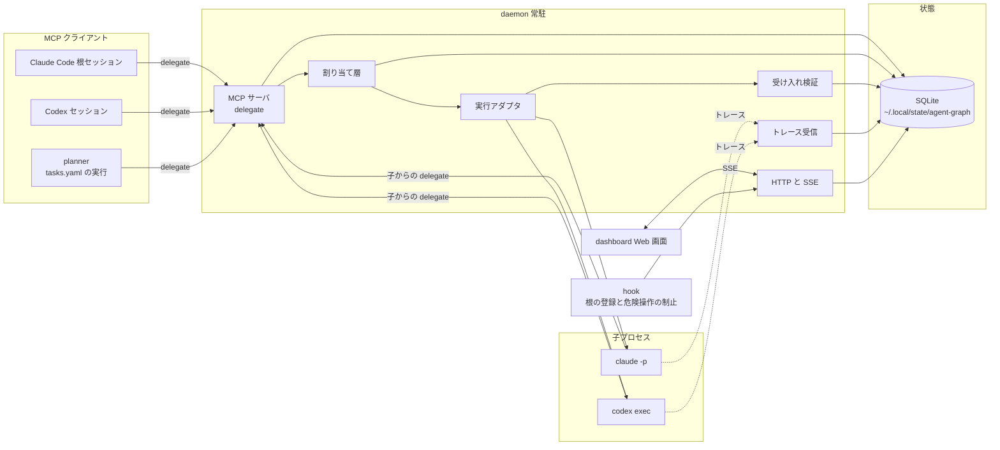
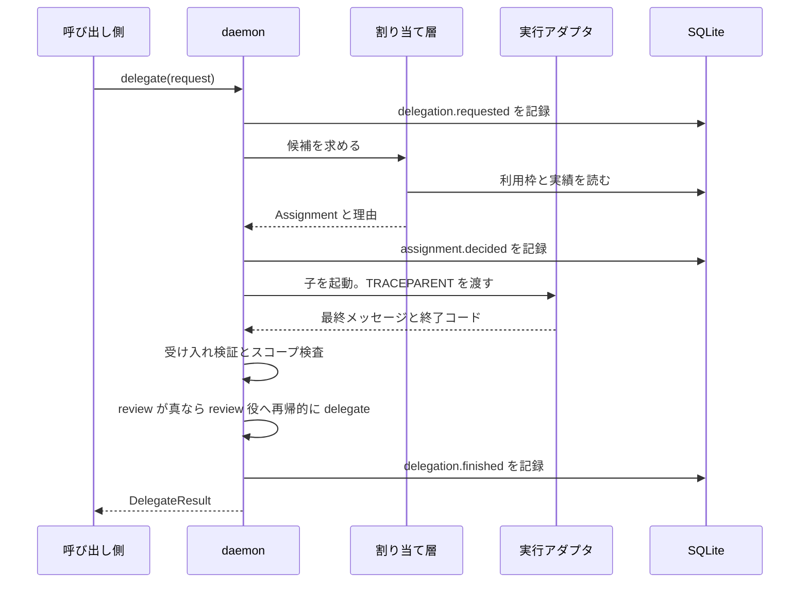
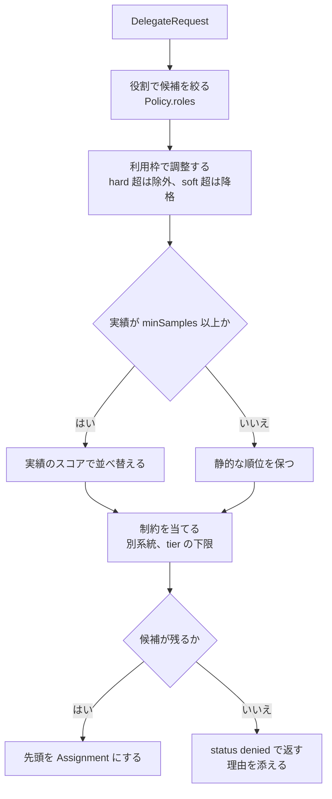

# agent-graph 設計書

- 版: 2026-09-25 初版、同日 実装結果を反映
- 読み手: これから実装する AI エージェントと人
- 位置づけ: 決定済みの設計を固定し、未確認事項を切り分ける

## 目的

agent-graph は AI エージェント同士の委譲を記録し、可視化し、割り当てを改善する常駐デーモンである。
Claude Code と Codex のどちらからでも同じ口で委譲できる。

優先順位は次の 3 つで固定する。

1. 可視化。委譲を有向グラフで見せる。Claude から Codex、Codex から Claude のどの向きもつなぐ
2. 割り当て。役割ごとに最適なモデルを選ぶ。コストを抑えつつ出力の質を上げる
3. 付随物。受け入れ検証、レビュー、権限、サンドボックス。1 と 2 の上に乗せる

価値の核は循環にある。グラフのデータが割り当てを改善し、改善した割り当てがグラフに記録される。

### 旧実装の問題

旧実装は dotfiles の `.agents/` に置いた Python 製のキットである。次の問題を新版で解く。

| 問題 | 新版の対応 |
| --- | --- |
| hook が観測と制止とグラフ作りを 1 か所で抱える | hook は根の登録と危険操作の制止だけに絞る。観測はトレース、グラフはデーモンが作る |
| モデルの割り当てが CLAUDE.md の文章にあり、根の LLM が毎回読む | 割り当てをコードのポリシーにする。呼び出し側はモデルを渡さない |
| 状態に版や指紋が無く、前回のグラフの状態を引き継ぐ | SQLite のスキーマに版を持つ。グラフに指紋を持たせ、一致しない状態は読まない |
| `.agents/` が Codex のサンドボックスで読み取り専用になる | 状態を作業リポジトリの外に置く |
| root 所有のガードを sudo で入れる | sudo を要求しない。守りは各ツールの権限とサンドボックスに任せる |

## 全体の構成



委譲の口は MCP のツール `delegate` 1 本である。
子プロセスも同じ口を使うため、Claude から Codex、Codex から Claude のどの向きも 1 つのグラフに乗る。
デーモンは 1 台の計算機で 1 つ動き、リポジトリごとに状態を分ける。

## 部品の責務と境界

pnpm workspace のモノレポとし、次のパッケージに分ける。

| パッケージ | 責務 | 依存してよい先 |
| --- | --- | --- |
| `core` | イベントの型、トレース文脈、割り当て層、実行アダプタ、受け入れ検証、SQLite の保存 | Node 標準と SQLite だけ |
| `daemon` | MCP サーバ、ダッシュボード用 HTTP と SSE、トレース受信、利用枠の取得 | `core` |
| `dashboard` | Web 画面。グラフ、履歴、判断待ちの操作 | `daemon` の HTTP だけ |
| `adapters` | Claude Code プラグインと Codex 設定の生成。デーモンを MCP サーバとして登録する | `core` の型だけ |
| `planner` | tasks.yaml のグラフ実行。ready なタスクごとに `delegate` を呼ぶ | MCP クライアントとして `daemon` |

境界の規則は次の 3 つである。

- `core` はプロセスを起こす以外の副作用を持たない。ネットワークと画面は `daemon` と `dashboard` が持つ
- `planner` は `delegate` の利用者の 1 つに留める。割り当てと検証を自前で持たない
- `adapters` は登録だけを行う。実行時の処理を含めない

### 実行方式

実行は Node 互換で書く。Bun で単一バイナリにも固められる形に保つ。
SQLite は Node 24 の標準の `node:sqlite` を使う。
Bun での動作は未確認事項の U8 に残す。
MCP は SDK を使わず、改行区切りの JSON-RPC 2.0 を最小限で実装する。
依存をゼロに保ち、単一バイナリの方針を守るためである。

### 実行アダプタ

実行アダプタは `Executor` ごとに 1 つ持ち、子プロセスの起動と終了の観測を担う。

| Executor | 起動コマンド | モデルの渡し方 | 出力の受け取り |
| --- | --- | --- | --- |
| `claude` | `claude -p` | `--model` | stream-json の最終メッセージ |
| `codex` | `codex exec` | `-m` | `--output-last-message` のファイル |

アダプタは環境変数でトレース文脈と自分の委譲 id を子に渡す。
子が `delegate` を呼ぶと、デーモンはこの環境変数から親の span を復元する。

## delegate の入出力

呼び出し側は役割と依頼と受け入れ条件を渡す。モデルは渡さない。

```ts
type Role = "orchestrate" | "implement" | "research" | "document" | "review";
// 統括、実装、調査、文書、レビュー

interface DelegateRequest {
  role: Role;
  title: string;          // 40 字以内。グラフの辺ラベル
  task: string;           // 自己完結の依頼文。子は会話履歴を見ない
  accept: string[];       // 機械判定できる受け入れコマンド。1 つ以上
  scope?: string[];       // 触ってよいファイルの glob
  outputs?: string[];     // 期待する成果物のパス
  cwd?: string;           // 省略時は呼び出し側のリポジトリ
  constraints?: {
    excludeFamily?: ModelFamily[];   // 例: レビュアーを実装者と別系統にする
    excludeModels?: string[];
    minTier?: Tier;
  };
  timeoutSec?: number;    // 既定 1800
  review?: boolean;       // 合格後に review 役へ自動で委譲する。既定は implement のとき true
}

interface DelegateResult {
  delegationId: string;
  traceId: string;
  spanId: string;
  status: "done" | "failed" | "timeout" | "denied";
  assignment: Assignment;
  output: string;         // 子の最終メッセージ
  acceptance: AcceptanceResult;
  review?: ReviewResult;
  usage: TokenUsage;
  roundTrips: number;     // 同じ委譲での再指示の回数
}

interface AcceptanceResult {
  passed: boolean;
  results: { command: string; exitCode: number; output: string; durationMs: number }[];
  scopeViolations: string[];
}

interface ReviewResult {
  verdict: "approve" | "request_changes";
  reviewer: Assignment;
  comment: string;
}
```

呼び出しの流れは次の順で固定する。



`delegate` は完了まで待つ。長い作業は MCP の進捗通知で途中経過を返す。
進捗通知の可否は未確認事項に置く。

### 呼び出し側の識別

デーモンは呼び出し側がどのセッションか知る必要がある。
`adapters` は各クライアントに stdio の薄い shim を登録する。
shim は自分の環境変数から `TRACEPARENT` と `AGENT_GRAPH_SESSION` と cwd を読み、Unix ソケット経由でデーモンに転送する。
デーモン本体は 1 つで、shim はクライアントごとに起きる。

呼び出し側の系統は、登録時の環境変数 `AGENT_GRAPH_CLIENT` で決める。
値は `claude` と `codex` と `planner` の 3 つである。
未設定のとき shim は親プロセスの実行ファイル名から推定する。
デーモンはこの値を `sessions.client` に記録する。
記録した値をグラフの根の系統に使う。

Codex は stdio の MCP サーバに環境変数を渡せる。
`mcp_servers.<名前>.env` で固定値を指定する。
`mcp_servers.<名前>.env_vars` で親の環境変数を引き継ぐ。
shim は `AGENT_GRAPH_CLIENT` を `env` の固定値で受け取る。
`TRACEPARENT` は `env_vars` で親から受け取る。

`codex exec` の子も MCP クライアントとして `delegate` を呼べる。
これで Codex から Claude への委譲も完了する。
exec の承認方針が `never` だと MCP ツールの呼び出しは拒まれる。
そこで `mcp_servers.<名前>.tools.delegate.approval_mode = "approve"` で事前に承認する。
`tool_timeout_sec` は委譲の完了を待てるよう 1800 秒に延ばす。

## イベントとトレースの型

観測の単位は span である。`delegate` の呼び出し 1 回を 1 span とする。
span の入れ子が委譲の有向グラフになる。

```ts
interface TraceContext {
  traceId: string;        // 32 桁 hex。根のセッションで採る
  spanId: string;         // 16 桁 hex
  parentSpanId?: string;
  traceState?: string;
}
// 子プロセスへは W3C trace context の形式で渡す
// TRACEPARENT=00-<traceId>-<spanId>-01
// TRACESTATE=agent-graph=session:<sessionId>;delegation:<delegationId>

type EventKind =
  | "session.started"         // hook が根の起動を登録する
  | "delegation.requested"
  | "assignment.decided"
  | "execution.started"
  | "execution.finished"
  | "acceptance.evaluated"
  | "review.evaluated"
  | "delegation.finished"
  | "usage.sampled"           // 利用枠の観測
  | "guard.denied";           // hook が危険操作を止めた

interface Event<K extends EventKind = EventKind> {
  id: string;                 // ULID
  ts: string;                 // ISO 8601
  kind: K;
  repo: string;               // repo key
  session?: string;
  trace: TraceContext;
  payload: EventPayload[K];
}

interface Span {
  trace: TraceContext;
  name: string;               // "delegate" | "assign" | "execute" | "accept" | "review"
  startedAt: string;
  endedAt?: string;
  status: "ok" | "error" | "unset";
  attributes: Record<string, string | number | boolean>;
  // attributes の必須キー
  // agent.role, agent.executor, agent.model, agent.session, agent.delegation
}
```

トレースの取り方は 2 段で用意する。

1. 第一候補。Claude Code と Codex が OpenTelemetry で span を出すなら、デーモンの OTLP 受信で受ける
2. 代替。出せない場合は実行アダプタが起動と終了で span を作り、hook とセッション記録の読み取りで補う

代替では Claude Code の hook イベントと `~/.codex/sessions/` の jsonl を読み、子の内部の tool 呼び出しを span に起こす。
どちらで行くかは未確認事項の結果で決める。

## 割り当て層の判断

割り当て層はコードのポリシーである。LLM に判断させない。

```ts
type Executor = "claude" | "codex";
type ModelFamily = "anthropic" | "openai";
type Tier = "high" | "mid" | "low";

interface Candidate {
  executor: Executor;
  model: string;              // 例: "opus", "gpt-5.6-terra"
  family: ModelFamily;
  tier: Tier;
}

interface Assignment extends Candidate {
  reason: string[];           // 各段で残った理由。ダッシュボードに出す
  policyVersion: string;
}

interface Policy {
  roles: Record<Role, Candidate[]>;      // 役割ごとの候補。並び順が既定の優先
  quota: {
    softLimitPercent: number;            // 既定 70。超えたら順位を下げる
    hardLimitPercent: number;            // 既定 90。超えたら候補から外す
  };
  performance: {
    minSamples: number;                  // 既定 20。未満なら静的な順位を使う
    weights: { acceptRate: number; reviewApprove: number; roundTrips: number; tokens: number };
  };
  constraints: Constraint[];
}

type Constraint =
  | { kind: "reviewerDifferentFamily" }        // レビュアーを実装者と別系統にする
  | { kind: "implementerNotOrchestrator" }     // 実装者に統括と同じモデルを使わない
  | { kind: "minTierForRole"; role: Role; tier: Tier };
```

判断は 4 段で進める。各段で残った理由を `reason` に積む。



### 利用枠の取得元

| 提供元 | 取得方法 | 主な値 |
| --- | --- | --- |
| Claude Code | `claude -p --input-format stream-json` に `control_request` の `get_usage` を送る | `five_hour` と `seven_day` の `utilization`。`model_scoped` にモデル別の週枠 |
| Codex | `~/.codex/sessions/YYYY/MM/DD/*.jsonl` の行の `payload.rate_limits` を読む | `primary.used_percent` と `window_minutes` と `resets_at` |

取得はデーモンが周期的に行い、`usage.sampled` として記録する。
Claude Code の問い合わせは `claude` を起こすため、5 分に 1 回を上限にする。

### 実績

実績は `delegations` と `acceptances` と `reviews` から集計する。
指標は受け入れ合格率、レビュー判定、往復回数、消費トークンの 4 つである。
集計の単位は役割とモデルの組にする。

最初は静的な表で始める。実績が `minSamples` に達した組から実績で選ぶ。

## SQLite の主な表

状態は SQLite に置く。スキーマに版を持たせ、起動時に移行する。

| 表 | 主なカラム | 用途 |
| --- | --- | --- |
| `schema_version` | `version`, `applied_at` | 移行の記録 |
| `repos` | `key`, `root_path`, `name` | 状態を分ける単位 |
| `sessions` | `id`, `repo_key`, `name`, `client`, `trace_id`, `started_at` | 根の登録。`name` は `<repo>-<No>` |
| `graphs` | `id`, `repo_key`, `session_id`, `goal`, `fingerprint`, `created_at` | planner のグラフ。指紋で同一性を判定する |
| `tasks` | `graph_id`, `id`, `title`, `role`, `depends_on`, `state`, `attempts` | tasks.yaml の 1 タスク |
| `delegations` | `id`, `repo_key`, `session_id`, `parent_id`, `task_id`, `role`, `title`, `status`, `round_trips` | `delegate` の 1 回 |
| `assignments` | `delegation_id`, `executor`, `model`, `family`, `tier`, `reason`, `policy_version` | 割り当ての結果と理由 |
| `spans` | `trace_id`, `span_id`, `parent_span_id`, `name`, `started_at`, `ended_at`, `status`, `attributes` | トレース |
| `events` | `id`, `ts`, `kind`, `repo_key`, `session_id`, `trace_id`, `span_id`, `payload` | 追記専用の記録 |
| `acceptances` | `delegation_id`, `passed`, `results`, `scope_violations` | 受け入れ検証 |
| `reviews` | `delegation_id`, `reviewer_delegation_id`, `verdict`, `comment` | レビュー |
| `usage_samples` | `ts`, `provider`, `window`, `percent`, `resets_at`, `model` | 利用枠の観測 |
| `token_usage` | `delegation_id`, `input_tokens`, `output_tokens`, `model` | 消費トークン |

### 指紋

グラフの指紋は goal とタスクの id と executor から作る。

```ts
function fingerprint(graph: { goal: string; tasks: { id: string; role: Role }[] }): string {
  const body = [
    graph.goal.trim(),
    ...graph.tasks.map((t) => `${t.id}:${t.role}`).sort(),
  ].join("\n");
  return sha256(body).slice(0, 16);
}
```

planner は起動時に指紋を計算する。
同じ指紋の `graphs` 行があるときだけ前回の `tasks.state` を引き継ぐ。
一致しないときは新しい `graphs` 行を作り、前回の状態と作業ブランチを読まない。

## 置き場

作業するリポジトリの中に状態を置かない。

| 種類 | 場所 | 中身 |
| --- | --- | --- |
| 実行時の状態 | `~/.local/state/agent-graph/<repo-key>/agent-graph.db` | SQLite |
| デーモンのソケットとログ | `~/.local/state/agent-graph/run/` | `daemon.sock`, `daemon.log`, `daemon.pid` |
| worktree | `~/.cache/agent-graph/worktrees/<repo-key>/<session>/<task>/` | planner が切る作業木 |
| 利用枠の探索用 cwd | `~/.cache/agent-graph/usage-probe/` | `claude -p` を起こす場所 |
| 個人の設定 | `~/.config/agent-graph/config.toml` | ダッシュボードのポート、herdr の有無 |
| 割り当てポリシーの個人値 | `~/.config/agent-graph/policy.toml` | `Policy` の上書き |
| プロジェクト固有の設定 | `<repo>/agent-graph.toml` | 必要なときだけ置く。accept の既定、scope の除外 |

`repo-key` は git ルートの basename と、ルートの絶対パスの sha256 先頭 8 桁をつないだ値にする。
同名のリポジトリを別の場所に置いても混ざらない。

個人の設定と `policy.toml` は利用者の dotfiles に置き、`~/.config/agent-graph/` へリンクする。
agent-graph 本体は個人値を持たない。

`XDG_STATE_HOME` と `XDG_CACHE_HOME` と `XDG_CONFIG_HOME` が設定されていれば優先する。

## セキュリティの考え方

sudo を要求しない。root 所有のファイルを作らない。

守りは各ツールの仕組みに任せる。

| 層 | 担うもの | agent-graph の関わり |
| --- | --- | --- |
| Claude Code の権限設定 | ツール呼び出しの allow と deny | プラグインが推奨の deny を同梱する |
| Claude Code のサンドボックス | 無人実行の子の書き込みと通信の制限 | `claude` アダプタが `--settings` で渡す |
| Codex のサンドボックス | cwd 外への書き込みの禁止 | `codex` アダプタが `--sandbox workspace-write` を渡す |
| hook | 根の登録と危険操作の制止 | `session.started` と `guard.denied` を記録する。プラグインが MCP サーバと同時に配る |

hook の役割は 2 つに限る。
根の起動を `sessions` に登録することと、`git push` や `sudo` などの危険操作を止めることである。
グラフを作る処理と観測は hook に置かない。
`claude -p` で起きた子でも `SessionStart` の hook は動く。
子の起動も `sessions` に登録される。

デーモン自身の守りは次の 3 つである。

- Unix ソケットは `0600` で作る。他のユーザーから接続できない
- ダッシュボードの HTTP は `127.0.0.1` にだけ bind する
- 秘密情報を保存しない。子の出力から `.env` や鍵の内容を検出したら伏せてから保存する

受け入れコマンドは呼び出し側の権限で worktree の中で走る。
デーモンは権限を昇格しない。

## 作る順序と完了条件

旧 Python 版は新版が追いつくまで使い続ける。段ごとに完了条件を機械で判定する。

| 段 | 作るもの | 完了条件 |
| --- | --- | --- |
| 1 | イベントの型、トレース文脈、SQLite の保存と移行 | `pnpm test` が通る。`TRACEPARENT` の往復と `schema_version` の移行のテストを含む |
| 2 | `delegate` の MCP と `claude` と `codex` の実行アダプタ | Claude Code から `delegate` を呼び、Codex の子が完了し `DelegateResult` が返る。逆向きも同じ |
| 3 | 割り当て層 | 静的な表で `Assignment` と `reason` を返す。利用枠の hard 超で候補が外れるテストが通る |
| 4 | ダッシュボード | SSE で `delegations` の追加が 2 秒以内に画面へ出る。Claude と Codex の双方向の辺が描かれる |
| 5 | Claude Code プラグインと Codex 設定の生成 | 生成物を入れた新規リポジトリで、手作業なしに `delegate` が見える |
| 6 | planner と付随物 | tasks.yaml の実行が受け入れ検証とレビューを通り、旧版の `agr launch` と同じ結果になる |

段 2 が終わった時点で可視化の目的を満たす。段 3 で割り当ての目的を満たす。
段 6 は旧版と並走して差分を比べ、同等になった時点で旧版を止める。

## 未確認事項

決定済みの設計と混ぜない。確認できたら本文へ移す。

| 番号 | 事項 | 確認方法 | 確認できないときの代替 |
| --- | --- | --- | --- |
| U1 | Claude Code が OpenTelemetry で span を外部へ出せるか | 公式文書と `claude --help` の環境変数を読む | hook と `~/.claude/projects/` の transcript から span を起こす |
| U2 | Codex が OpenTelemetry で span を外部へ出せるか | 公式文書と `codex --help` を読む | `~/.codex/sessions/` の jsonl から span を起こす |
| U3 | `control_request` の `get_usage` が今後も使えるか | 2026-09-25 時点で旧実装の `usage_probe.py` が動作している。版ごとに再確認する | statusline の表示を読む。取れなければ利用枠の段を飛ばす |
| U4 | Codex の `payload.rate_limits` の形が版で変わらないか | 2026-09-25 時点の jsonl で `primary.used_percent` を確認済み | 欠けた値は無視し、利用枠の段を飛ばす |
| U5 | MCP の進捗通知を Claude Code と Codex が受けるか | 長い `delegate` を呼び、通知の表示を見る | 通知を出さず、完了まで待つ |
| U8 | Bun の単一バイナリに SQLite を同梱できるか | `node:sqlite` と `bun:sqlite` の互換層を試す | Node 実行だけを正式に支援する |